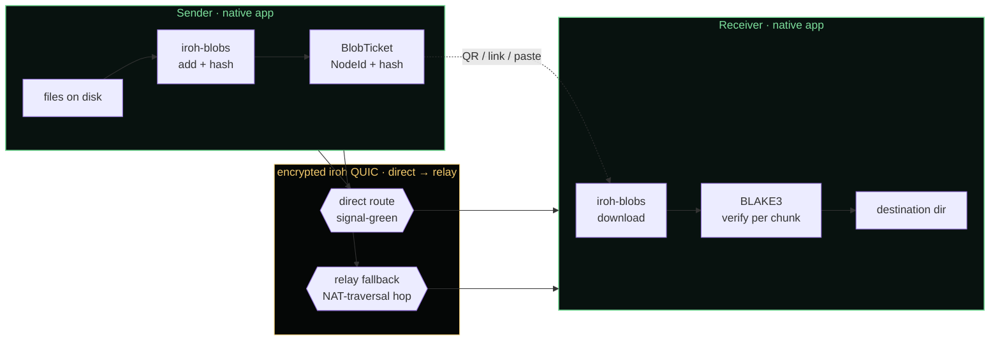

<div align="center">

```
██╗     ██╗ ██████╗ ██╗  ██╗████████╗███╗   ██╗██╗███╗   ██╗ ██████╗     ██████╗ ██████╗ ██████╗ 
██║     ██║██╔════╝ ██║  ██║╚══██╔══╝████╗  ██║██║████╗  ██║██╔════╝     ██╔══██╗╚════██╗██╔══██╗
██║     ██║██║  ███╗███████║   ██║   ██╔██╗ ██║██║██╔██╗ ██║██║  ███╗    ██████╔╝ █████╔╝██████╔╝
██║     ██║██║   ██║██╔══██║   ██║   ██║╚██╗██║██║██║╚██╗██║██║   ██║    ██╔═══╝ ██╔═══╝ ██╔═══╝ 
███████╗██║╚██████╔╝██║  ██║   ██║   ██║ ╚████║██║██║ ╚████║╚██████╔╝    ██║     ███████╗██║     
╚══════╝╚═╝ ╚═════╝ ╚═╝  ╚═╝   ╚═╝   ╚═╝  ╚═══╝╚═╝╚═╝  ╚═══╝ ╚═════╝     ╚═╝     ╚══════╝╚═╝     
```

### **Direct files. Verified bytes. No cloud account.**

A free, open-source peer-to-peer file transfer app for **Windows + Android.**
Built on **Rust**, **Tauri 2**, **iroh QUIC**, **iroh-blobs**, and **BLAKE3**.

<sub>◆ no upload step ◆ no account ◆ no artificial file-size cap ◆ no telemetry ◆ no cloud bucket ◆</sub>

[](LICENSE)
[](https://github.com/Kerim-Sabic/lightning-p2p/releases/tag/v0.4.6)
[](https://github.com/Kerim-Sabic/lightning-p2p/releases/tag/v0.4.6)
[](https://github.com/Kerim-Sabic/lightning-p2p/releases/tag/v0.5.1)
[](https://www.rust-lang.org/)
[](https://tauri.app/)
[](https://iroh.computer/)
[](https://github.com/BLAKE3-team/BLAKE3)
[](https://lightning-p2p.netlify.app/)

[**Download**](https://github.com/Kerim-Sabic/lightning-p2p/releases/latest)
· [**Website**](https://lightning-p2p.netlify.app/)
· [**AUDIT.md**](AUDIT.md)
· [**Roadmap**](docs/ROADMAP_v0.5_to_v0.7.md)
· [**Changelog**](CHANGELOG.md)
· [**Security**](#-security-model)

</div>

---

> **In 30 seconds.** Lightning P2P sends a file by handing the receiver a
> tiny ticket (NodeId + content hash). The receiver pulls the bytes
> directly from the sender's device over an encrypted iroh QUIC connection.
> No upload step. No cloud bucket. **BLAKE3 verifies every chunk as it
> lands.** When NAT blocks the direct path, iroh relay carries the
> encrypted frames — still no plaintext on any server.

---

## ◆ What it is, what it isn't

| ✓ Best fit | ✗ Not for |
| --- | --- |
| Moving large builds, databases, media between Windows machines | Browser-only transfer (web is handoff, not the engine) |
| Windows ↔ Android sideload testing | macOS / Linux production (planned, not shipped) |
| Sharing without cloud accounts, upload caps, or hosted retention | AirDrop protocol compatibility |
| Open-source workflows that need inspectable artifacts + checksums | Phone-to-phone NFC writing (NFC receive only) |
| Honest benchmark methodology with committed evidence | "Fastest in the world" marketing claims |

---

## ◆ Install

Stable: **v0.4.6**. Experimental: **v0.5.1** (speed modes + reliability hardening; carries v0.5.0 BLE/NFC).

| Platform | Asset | Channel | Best for |
| --- | --- | --- | --- |
| **Windows** | [`LightningP2P-win-Setup.exe`](https://github.com/Kerim-Sabic/lightning-p2p/releases/latest/download/LightningP2P-win-Setup.exe) | Stable | Most users · one-click Velopack |
| **Windows** | [`LightningP2PSetup.exe`](https://github.com/Kerim-Sabic/lightning-p2p/releases/latest/download/LightningP2PSetup.exe) | Stable | Classic NSIS |
| **Windows** | [`LightningP2P.msi`](https://github.com/Kerim-Sabic/lightning-p2p/releases/latest/download/LightningP2P.msi) | Stable | Policy-managed deployments |
| **Android** | [`LightningP2P-android-latest.apk`](https://github.com/Kerim-Sabic/lightning-p2p/releases/latest/download/LightningP2P-android-latest.apk) | Stable | Android 10+ sideload (signed) |
| **Experimental** | [Release v0.5.1](https://github.com/Kerim-Sabic/lightning-p2p/releases/tag/v0.5.1) | Pre-release | Speed modes · retry/backoff · cancel-race fix |

<details>
<summary><b>◆ Verify your install before you trust it</b> (click to expand)</summary>

```powershell
# Windows — checksums and Authenticode
powershell -ExecutionPolicy Bypass -File .\scripts\verify-release.ps1 `
  -Installer .\LightningP2P-win-Setup.exe `
  -Checksums .\SHA256SUMS.txt

# Android — file hash + signer certificate
(Get-FileHash .\LightningP2P-android-latest.apk -Algorithm SHA256).Hash
Get-Content .\SHA256SUMS-android.txt | Select-String "LightningP2P-android-latest.apk"
apksigner verify --print-certs --verbose .\LightningP2P-android-latest.apk
```

The signed Android APK's signer certificate fingerprint:

```
5F:A0:D6:63:46:FF:9C:91:1B:18:D1:2A:5F:77:F1:F0:9B:2D:E2:A7:69:A0:97:68:6C:FC:FA:43:BD:86:29:16
```

Full trust guide: [`docs/download-trust.md`](docs/download-trust.md).

</details>

---

## ◆ How it works



1. Sender picks files / folders / an Android share-sheet item.
2. Rust engine imports content into the local iroh-blobs store.
3. A receive ticket is generated (`NodeId + content hash + format`).
4. Receiver opens a **QR**, **HTTPS handoff link**, **deep link**, or pastes the raw ticket.
5. iroh dials **direct QUIC**; falls back to **relay-assisted** route when NAT blocks the path.
6. iroh-blobs streams **BLAKE3-verified** bytes to the destination.

Handoff URLs use `/receive#t=<ticket>` — the ticket lives in the URL fragment, so it **never reaches the website server**.

---

## ◆ Speed modes <sup>v0.5.1</sup>

Five session-level transfer modes. Each swaps a **complete** transport profile: QUIC send/recv/stream windows, max streams, keepalive, import concurrency, idle timeout, UI emit cadence. Persists across launches; node restarts on change (deferred if a transfer is in flight).

| Mode | Parallelism | Emit | Conn win | Stream win | Streams | Idle | Default for |
|---|---:|---:|---:|---:|---:|---:|---|
| **Battery Safe** | 8 | 250 ms | 64 MB | 16 MB | 256 | 30 s | Android |
| **Standard** | 64 | 100 ms | 256 MB | 64 MB | 1024 | 60 s | Desktop |
| **Fast** | 128 | 100 ms | 256 MB | 64 MB | 1024 | 60 s | — |
| **Extreme** | 128 | 200 ms | 512 MB | 128 MB | 2048 | 90 s | — |
| **LAN Beast** | 128 | 200 ms | **1024 MB** | **256 MB** | **4096** | 120 s | — |

> **Honest scope.** On same-machine loopback all five modes cluster within ~13% (626 – 710 Mbps median). The hierarchy encodes design intent; LAN/WAN throughput-delta validation lands in v0.6.<br/>
> Mode-sweep receipts: [`AUDIT.md §2.1.1`](AUDIT.md) · [`docs/reports/raw/audit-v0.5.1/mode-sweep/`](docs/reports/raw/audit-v0.5.1/mode-sweep/).

---

## ◆ Benchmarks

The bench tool lives at [`src-tauri/src/bin/benchmark_local.rs`](src-tauri/src/bin/benchmark_local.rs). It generates payloads at runtime (xorshift PRNG), spins up two `LightningP2PNode` instances in temp dirs, and runs the **real** `sender::create_share` + `receiver::receive_ticket` paths.

**Current reference** — same-machine loopback, AMD Zen 5 + Windows 11 Build 26200 + NVMe, 5 runs each, schema v2:

| Scenario | Runs | Median total | Export | Effective |
|---|---:|---:|---:|---:|
| `same_machine_10mb` | 5/5 | 147 ms | 7 ms | **569.89 Mbps** |
| `same_machine_100mb` | 5/5 | 1,356 ms | 7 ms | **618.45 Mbps** |
| `same_machine_1gb` | 5/5 | 13,565 ms | 8 ms | **633.21 Mbps** |
| `same_machine_many_small` <sub>(200 × 100 KB)</sub> | 5/5 | 512 ms | 274 ms | **327.05 Mbps** |

<blockquote>
<b>Caveat:</b> Same-machine loopback only. <b>Not</b> WAN. <b>Not</b> Windows ↔ Android. <b>Not</b> Wi-Fi. <b>Not</b> relay. Don't quote these for "fastest" claims.
</blockquote>

<details>
<summary><b>◆ Reproduce locally</b></summary>

```powershell
# Smoke (10 MB only · ~30s)
pnpm bench:local

# Full (10 MB / 100 MB / 1 GB / many-small)
pnpm bench:local:full

# Direct — with explicit mode + hardware notes
.\src-tauri\target\release\benchmark-local.exe `
  --profile full --runs 5 --mode standard `
  --hardware-notes "AMD Zen 5, Win 11 26200, NVMe" `
  --output-dir docs/reports/raw/local
```

Raw JSON + CSV: [`docs/reports/raw/`](docs/reports/raw/). Methodology + template: [`docs/BENCHMARKS.md`](docs/BENCHMARKS.md) · [`docs/benchmark-report-template.md`](docs/benchmark-report-template.md).

</details>

---

## ◆ Security model

Lightning P2P avoids cloud file hosting, but receive **tickets are capability tokens**. Anyone with a valid ticket can request the content while the sender is online — treat tickets like secrets.

| Property | How |
|---|---|
| **Transport** | Every byte encrypted by iroh's QUIC stack. TLS 1.3 keys derived per-session. |
| **Integrity** | BLAKE3 verifies as the receiver streams to disk. Bad bytes surface as structured errors, never silent corruption. |
| **Storage** | Sender keeps the file on disk until receive completes. There is no upload step to a hosted bucket. |
| **Relay** | Connectivity help (a hop when NAT blocks the direct path). Not retention. Relay sees encrypted QUIC frames, not plaintext. |
| **Diagnostics** | Bundles gathered locally, redacted, copied by the user. The frontend never auto-posts transfer secrets. |
| **Telemetry** | None by default. The native app does not phone home. |
| **Sender contract** | Keep the sender online until receive finishes. Closing the app cancels in-flight transfers. |

Read [`SECURITY.md`](SECURITY.md) · [`docs/security-model.md`](docs/security-model.md) · [`docs/download-trust.md`](docs/download-trust.md) before using on sensitive machines.

---

## ◆ What works today

| | Capability | Status |
|:-:|---|---|
| 🟢 | Windows send + receive (Tauri 2 desktop) | **Stable** |
| 🟢 | Android send + receive (sideload APK) | **Stable** |
| 🟢 | Android system share-target | **Stable** v0.4.6 |
| 🟢 | Android MediaStore routing (Pictures / Movies / Music / Downloads) | **Stable** v0.4.6 |
| 🟢 | QR + handoff link + raw ticket | **Stable** |
| 🟢 | Nearby Wi-Fi / LAN discovery (mDNS) | **Stable** |
| 🟢 | iroh relay fallback when direct path is blocked | **Stable** |
| 🟢 | Atomic single-blob writes (`.part` + rename) | **Stable** v0.5.1 |
| 🟢 | Retry + exponential backoff on transient receive errors | **Stable** v0.5.1 |
| 🟢 | Implicit resume across restarts (re-paste ticket) | **Stable** (iroh-blobs persistent store) |
| 🟡 | Speed modes (5 profiles) | **Experimental** v0.5.1 |
| 🟡 | BLE proximity discovery (Android + Windows) | **Experimental** since v0.5.0 |
| 🟡 | NFC ticket receive (Android) | **Experimental** since v0.5.0 |
| ⏳ | Explicit resume UI for failed transfers | Planned v0.6 |
| ⏳ | Phone-to-phone NFC write, macOS/Linux BLE | Roadmap |
| ⏳ | macOS / Linux / iOS desktop builds | Roadmap |

<sub>BLE and NFC **never carry file bytes** — beacons + ticket material only. Bytes always travel through iroh QUIC. Full behavior + hardware test plan: [`docs/proximity.md`](docs/proximity.md).</sub>

---

## ◆ Architecture

```
src/                                React + TypeScript marketing + receive shell
src/components/WebLandingPage.tsx     cinematic landing (Cabinet Grotesk, motion-led)
src/components/ReceiveHandoffPage.tsx /receive#t=<ticket> handoff

src-tauri/                          Rust backend · Tauri 2 IPC · iroh engine
src-tauri/src/node/                   endpoint · relay · discovery · nearby ALPN
src-tauri/src/transfer/               send · receive · export · progress · mode profiles
src-tauri/src/storage/                settings · history · peer cache (sled)
src-tauri/src/proximity/ble.rs        Windows WinRT BLE (Android peer under gen/)
src-tauri/src/bin/benchmark_local.rs  the bench tool

docs/                               architecture · trust · release · proximity · audit
scripts/                            release verification · benchmark · packaging
AUDIT.md                            v0.5.1 audit (root level, intentional)
```

### Architecture rules — enforced by code review

1. **Networking goes through iroh.** No raw sockets, no WebRTC, no HTTP file transfer.
2. **Blob transfer goes through iroh-blobs.** No custom chunking or hashing.
3. **Frontend ↔ backend communicate through Tauri IPC only.** No embedded HTTP server.
4. **React is presentational.** Rust owns transfer logic + persistence.
5. **Public claims attach to source, release artifacts, or benchmark evidence.** No exceptions.

Deeper reading: [`docs/ARCHITECTURE.md`](docs/ARCHITECTURE.md).

---

## ◆ Develop

Prereqs: **Node 22+** · **pnpm 10** · **Rust 1.81+** · platform Tauri toolchains.

```powershell
pnpm install
pnpm tauri dev               # native desktop app
pnpm dev                     # web (marketing site)
pnpm android:dev             # Android device/emulator (Tauri-Android)
```

PR gate (same matrix CI runs):

```powershell
pnpm check                   # release-state + lint + typecheck + test + build + cargo
```

Two profiles, two windows (test sender ↔ receiver on one machine):

```powershell
$env:LIGHTNING_P2P_PROFILE = "alice"; pnpm tauri dev
$env:LIGHTNING_P2P_PROFILE = "bob";   pnpm tauri dev
```

Environment overrides: [`.env.example`](.env.example).
Bench-time import-parallelism override: `$env:LIGHTNING_P2P_IMPORT_PARALLELISM = 16` (positive int).

---

## ◆ Contributing

High-impact areas:

- **Device testing** on real Windows + Android hardware (LAN, WAN, relay)
- **Benchmark reports** on different hardware (CPU, NIC, NVMe class) — file a PR with raw JSON
- **Accessibility + keyboard nav** across the app shell
- **Diagnostics + error copy** that helps users self-recover
- **macOS / Linux packaging spikes** (Tauri builders exist; CI is greenfield)
- **Proximity validation** with physical BLE + NFC hardware
- **Docs · screenshots · release verification**

Start with [`CONTRIBUTING.md`](CONTRIBUTING.md) · [`docs/README.md`](docs/README.md) · [`docs/ROADMAP_v0.5_to_v0.7.md`](docs/ROADMAP_v0.5_to_v0.7.md).

---

## ◆ License + citation

[**Apache-2.0**](LICENSE) · see also [NOTICE](NOTICE).

Citing Lightning P2P in research, posts, or benchmarks? Use [`CITATION.cff`](CITATION.cff).

---

<div align="center">

```
◆ ◇ ◆ ◇ ◆ ◇ ◆ ◇ ◆ ◇ ◆ ◇ ◆ ◇ ◆ ◇ ◆ ◇ ◆ ◇ ◆ ◇ ◆ ◇ ◆ ◇ ◆ ◇ ◆ ◇ ◆ ◇ ◆
```

**Built by [Horalix](https://horalix.com)** · Powered by [**iroh**](https://iroh.computer/) + [**iroh-blobs**](https://www.iroh.computer/proto/iroh-blobs) + [**Tauri**](https://tauri.app/) · _Direct files. Verified bytes. No cloud account._

</div>
