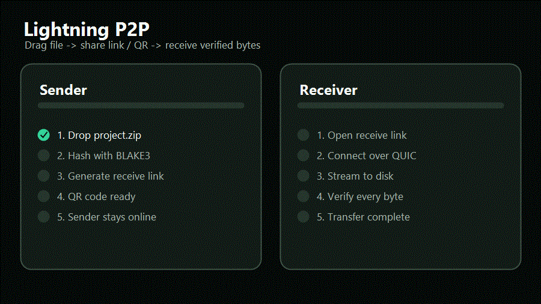

<div align="center">

# Lightning P2P

**Direct peer-to-peer file transfer for Windows and Android. No cloud upload. No account. No artificial file-size cap.**

Built with **Rust**, **Tauri v2**, **iroh** (QUIC + relay fallback), **iroh-blobs** (BLAKE3-verified streaming), and **React 19**.

[](LICENSE)
[](https://github.com/Kerim-Sabic/lightning-p2p/releases/latest)
[](https://github.com/Kerim-Sabic/lightning-p2p/releases/latest)
[](https://www.rust-lang.org/)
[](https://tauri.app/)
[](https://iroh.computer/)
[](https://github.com/BLAKE3-team/BLAKE3)

[Download](https://github.com/Kerim-Sabic/lightning-p2p/releases/latest) |
[Website](https://lightning-p2p.netlify.app/) |
[Security](SECURITY.md) |
[Privacy](PRIVACY.md) |
[Roadmap](docs/ROADMAP.md) |
[Contribute](CONTRIBUTING.md) |
[Cite](CITATION.cff)

</div>

---

## Demo



---

## Try It In 60 Seconds

1. Download the latest stable Windows installer or Android APK from [GitHub Releases](https://github.com/Kerim-Sabic/lightning-p2p/releases/latest).
2. Open Lightning P2P on the sender and drop in a file or folder.
3. Share the receive link or QR code with the receiver.
4. Keep the sender online while the receiver streams BLAKE3-verified bytes to disk.

Best fit:

- sending large files without cloud upload
- Windows-to-Windows or Windows-to-Android transfer
- direct LAN transfer with WAN fallback when networks are hard
- open-source workflows where release checksums and source code matter
- research, benchmarking, and experiments that need citation metadata

Not the right fit yet:

- macOS, Linux, or iOS production installs
- browser-only file transfer
- Apple AirDrop protocol compatibility
- third-party security-audited deployments

## One-Line Answer

Lightning P2P is a free Apache-2.0 peer-to-peer file transfer app for Windows and Android that sends files directly between devices with iroh QUIC, BLAKE3 verification, no account, no cloud upload, and no artificial file-size cap.

## Why It Exists

Moving large files still too often means uploading to a cloud bucket first, creating an account, or hoping both devices are on the same LAN. Lightning P2P is built for the direct path: sender keeps the file, receiver pulls verified bytes, and iroh handles connectivity.

| Tool | Cloud upload? | Account? | Works across networks? | Open source? | Native Windows/Android app? |
| --- | :-: | :-: | :-: | :-: | :-: |
| Email attachments | yes | yes | yes | no | no |
| Generic cloud drives | yes | yes | yes | no | yes |
| LAN-only sharing apps | no | no | no | varies | varies |
| Browser drop tools | usually no | no | partial | varies | no |
| CLI transfer tools | no | no | yes | yes | no |
| **Lightning P2P** | **no** | **no** | **yes** | **yes** | **yes** |

Lightning P2P does not create a hosted retention link or upload your file to a third-party storage service. The sender stays online, the receiver opens a ticket, and the transfer streams over encrypted iroh connectivity with BLAKE3 verification.

## Stable Release: v0.4.6

`v0.4.6` is the stable public release target for the current README and website.

- **Android send works with real file picker URIs.** `content://` files are resolved into app-private cache before iroh-blobs imports them.
- **Android receives route to normal media locations.** Pictures go to Pictures, videos to Movies, audio to Music, and other files to Downloads under a `Lightning P2P` folder.
- **Android system share target.** Share from Gallery, Files, or another app into Lightning P2P and get a ticket without extra setup.
- **Android 10+ baseline.** `minSdk` is 29 so scoped storage can be used cleanly without `WRITE_EXTERNAL_STORAGE`.
- **Windows installers remain the stable path.** Velopack, NSIS, and MSI assets are published with checksums.

`v0.5.0` exists as an **experimental pre-release** for BLE proximity discovery and NFC tap-to-transfer. BLE and NFC carry discovery/ticket material only; file bytes still use iroh QUIC and iroh-blobs. Use `v0.4.6` unless you intentionally want to test experimental proximity features.

## Install

### Windows

Download from the [latest stable GitHub Release](https://github.com/Kerim-Sabic/lightning-p2p/releases/latest).

| Asset | Use it for |
| --- | --- |
| [`LightningP2P-win-Setup.exe`](https://github.com/Kerim-Sabic/lightning-p2p/releases/latest/download/LightningP2P-win-Setup.exe) | Recommended one-click Velopack installer |
| [`LightningP2PSetup.exe`](https://github.com/Kerim-Sabic/lightning-p2p/releases/latest/download/LightningP2PSetup.exe) | Classic NSIS installer |
| [`LightningP2P.msi`](https://github.com/Kerim-Sabic/lightning-p2p/releases/latest/download/LightningP2P.msi) | MSI for managed deployments |
| [`SHA256SUMS.txt`](https://github.com/Kerim-Sabic/lightning-p2p/releases/latest/download/SHA256SUMS.txt) | Checksums for release verification |

Verify a Windows installer:

```powershell
powershell -ExecutionPolicy Bypass -File .\scripts\verify-release.ps1 `
  -Installer .\LightningP2P-win-Setup.exe `
  -Checksums .\SHA256SUMS.txt
```

Requirements: Windows 10 or Windows 11 x64, Microsoft Edge WebView2 Runtime, and firewall permission for nearby LAN discovery.

### Android

Download both files from the [latest stable GitHub Release](https://github.com/Kerim-Sabic/lightning-p2p/releases/latest):

- `LightningP2P-android-latest.apk`
- `SHA256SUMS-android.txt`

Verify the APK hash before installing:

```powershell
(Get-FileHash .\LightningP2P-android-latest.apk -Algorithm SHA256).Hash
Get-Content .\SHA256SUMS-android.txt | Select-String "LightningP2P-android-latest.apk"
```

Verify the signer certificate if you have Android build tools:

```powershell
apksigner verify --print-certs --verbose LightningP2P-android-latest.apk
```

The published signer certificate SHA-256 digest is:

```text
5F:A0:D6:63:46:FF:9C:91:1B:18:D1:2A:5F:77:F1:F0:9B:2D:E2:A7:69:A0:97:68:6C:FC:FA:43:BD:86:29:16
```

Requirements: Android 10 (API 29) or newer, a Wi-Fi network that does not block multicast for nearby discovery, and enough free disk space for received files.

## How It Works

```text
Sender app                         Receive ticket                         Receiver app
files -> iroh-blobs store    ->    QR / link / paste string       ->      iroh-blobs fetch
local Rust node                    URL fragment handoff                   BLAKE3 verified bytes
        \_____________________ QUIC direct or relay-assisted path _____________________/
```

1. Sender picks files, a folder, or an Android system share.
2. Rust imports the content into the local iroh-blobs store.
3. Lightning P2P creates a receive ticket with the sender NodeId and content hashes.
4. Receiver opens a QR, HTTPS handoff link, deep link, or raw ticket.
5. iroh attempts direct QUIC connectivity and falls back to relay-assisted connectivity when direct dialing is blocked.
6. iroh-blobs streams verified bytes to disk with BLAKE3 content addressing.

Receive handoff links use `/receive#t=<ticket>`. The ticket is in the URL fragment, so normal HTTP requests to the website do not include it.

## What You Get

| Included | Not included |
| --- | --- |
| Direct-first P2P transfer | No cloud upload step |
| Relay fallback for hard networks | No hosted file retention bucket |
| BLAKE3 content verification | No artificial file-size cap |
| QR, link, and paste-ticket handoff | No account or email capture |
| Windows installers | No paid tier |
| Android sideload APK | No telemetry by default |
| Nearby LAN discovery | No custom protocol pretending to replace iroh |
| Apache-2.0 source license | No hidden proprietary core |

## Security Model

Lightning P2P keeps transferred file bytes out of third-party cloud storage, but receive tickets are capability tokens. Anyone with a valid ticket can request the referenced content while the sender is online and the content remains available.

- Transport: QUIC TLS through iroh.
- Integrity: BLAKE3 verification through iroh-blobs.
- Identity: persistent iroh identity stored in the OS keychain when available, with a profile-scoped app-data fallback.
- Relay fallback: connectivity help, not cloud storage.
- Telemetry: no product telemetry by default.
- Sender requirement: sender must stay online until the receiver finishes.

Read [SECURITY.md](SECURITY.md), [docs/download-trust.md](docs/download-trust.md), and [docs/android-trust.md](docs/android-trust.md) before installing builds on sensitive machines.

## Platform Status

| Platform | Status | Notes |
| --- | --- | --- |
| Windows | Stable public release | Velopack, NSIS, MSI, checksums |
| Android | Stable sideload release | Android 10+, system share target, smart MediaStore routing |
| Browser | Receive handoff only | Not the transfer engine |
| macOS / Linux | Planned | Packaging spike needed |
| iOS | Planned | Requires Apple signing, entitlements, and platform validation |
| BLE / NFC | Experimental in v0.5.0 | Discovery/ticket handoff only; not file transport |

## Architecture

```text
lightning-p2p/
  src/                  React + TypeScript presentation layer
  src-tauri/            Rust backend, Tauri commands, iroh transfer engine
    src/commands/       Tauri IPC handlers
    src/node/           iroh endpoint, discovery, nearby protocol
    src/transfer/       send, receive, export, progress, MIME routing
    src/storage/        settings, history, peer cache
    gen/android/        Android Gradle project and Kotlin glue
  docs/                 architecture, trust, release, security, roadmap
  scripts/              release verification and packaging helpers
```

Architecture invariants:

1. Networking goes through iroh.
2. Blob transfer goes through iroh-blobs.
3. Frontend and backend communicate through Tauri IPC only.
4. React is presentation; Rust owns transfer logic and persistence.
5. Tauri commands return typed results and surface actionable errors.

See [docs/ARCHITECTURE.md](docs/ARCHITECTURE.md) for module boundaries and transfer flow.

## Benchmarks

Lightning P2P is designed for high-throughput direct transfer, but the project does not claim speed leadership without repeatable public benchmark data. Start with [docs/BENCHMARKS.md](docs/BENCHMARKS.md) for the public evidence rules, then use [docs/benchmark-report-template.md](docs/benchmark-report-template.md) for LAN-direct, WAN-direct, relay-fallback, many-small-file, and large-single-file reports.

## Develop

```powershell
pnpm install
pnpm tauri dev
pnpm check
```

Expanded checks:

```powershell
pnpm lint
pnpm typecheck
pnpm build
cargo test --manifest-path src-tauri/Cargo.toml
cargo clippy --manifest-path src-tauri/Cargo.toml --all-targets -- -D warnings
```

Android:

```powershell
pnpm android:build:apk
pnpm android:build:aab
```

Same-machine transfer testing:

```powershell
$env:LIGHTNING_P2P_PROFILE = "alice"
.\src-tauri\target\release\lightning-p2p.exe

$env:LIGHTNING_P2P_PROFILE = "bob"
.\src-tauri\target\release\lightning-p2p.exe
```

## Contributing

Useful contributions:

- transfer reliability
- Android device testing
- packaging for macOS and Linux
- benchmark reports with methodology
- accessibility and keyboard navigation
- diagnostics and error messages
- docs, screenshots, and release verification

Start with [CONTRIBUTING.md](CONTRIBUTING.md), [docs/README.md](docs/README.md), and [docs/ARCHITECTURE.md](docs/ARCHITECTURE.md).

## Cite And License

Lightning P2P is licensed under Apache-2.0. See [LICENSE](LICENSE) and [NOTICE](NOTICE).

If you use Lightning P2P in research, benchmarks, posts, or derived work, please cite it with [CITATION.cff](CITATION.cff). GitHub will show this in the repository sidebar as "Cite this repository."

---

<div align="center">

**Star the repo if direct P2P transfer saved you from another upload link.**

</div>
