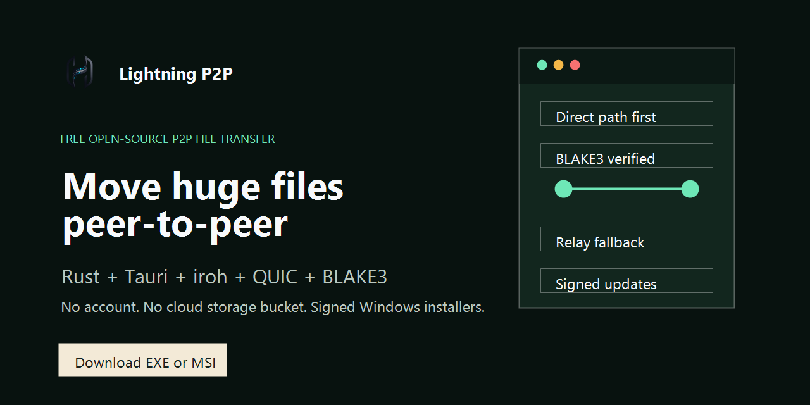

<div align="center">

<br />


<br /><br />

# Lightning P2P

### Free, open-source peer-to-peer file transfer for Windows.

**Lightning P2P** is a desktop peer-to-peer file transfer app built with Rust, iroh, and Tauri v2.<br />
No cloud. No accounts. No file size limits. Just direct, encrypted, verified transfers over LAN or the public internet.

<br />

[Website](https://lightning-p2p.netlify.app) &nbsp;&middot;&nbsp; [Download for Windows](#download) &nbsp;&middot;&nbsp; [Benchmarks](#benchmark-methodology) &nbsp;&middot;&nbsp; [Security](#security) &nbsp;&middot;&nbsp; [Contributing](#contributing)

<br />



</div>

---

## Current Status

- **Windows desktop app:** available now with signed release artifacts and auto-update metadata.
- **Public website:** Netlify-ready landing and SEO pages for download, security, benchmarks, and AirDrop-for-Windows searches.
- **Mobile/browser transfers:** planned, not shipped yet. The website works on mobile, but real transfers currently require the desktop app.
- **Speed claims:** benchmark-backed only. The app is built for high throughput, but public "fastest" claims should reference repeatable results.

## Why Lightning P2P?

Most file sharing tools route your data through the cloud, require accounts, or cap file sizes. Lightning P2P takes a different approach:

| Feature | Lightning P2P | Cloud Services | Other P2P Tools |
|---------|:---:|:---:|:---:|
| Direct device-to-device | **Yes** | No | Sometimes |
| End-to-end encrypted | **QUIC TLS 1.3** | Varies | Varies |
| No file size limit | **Yes** | Usually capped | Sometimes |
| No account required | **Yes** | No | Usually |
| Verified integrity | **BLAKE3** | Rarely | Rarely |
| NAT traversal built-in | **Yes** | N/A | Sometimes |
| Open source | **Yes** | Rarely | Sometimes |
| Native desktop app | **Yes** | Web only | Web/CLI |

## Key Features

- **Instant P2P transfers** using [iroh](https://iroh.computer) for QUIC networking, NAT traversal, and relay fallback
- **BLAKE3 verified streaming** with [iroh-blobs](https://docs.rs/iroh-blobs) -- every byte is cryptographically verified during transfer
- **End-to-end encrypted** via QUIC TLS 1.3 -- your files never touch a server
- **Nearby sharing** -- senders on the same LAN appear automatically on the receiver, no codes to type
- **QR code sharing** -- scan a code to start receiving on another device
- **Deep links** -- open `lightning-p2p://receive?t=<ticket>` from chat or email and the app jumps straight to the receive screen
- **Clipboard auto-detect** -- when a ticket is on the clipboard, Lightning P2P offers to paste it for you
- **Live progress tracking** -- speed, ETA, and progress bar updated in real-time
- **Transfer history** with one-click re-sharing of previously sent content
- **Auto-updates** with signed releases delivered through GitHub Releases
- **Native Windows installer** -- NSIS and MSI bundles with embedded WebView2 and automatic firewall rule setup

## Download

### Windows

Download the latest installer from [**GitHub Releases**](https://github.com/Kerim-Sabic/lightning-p2p/releases). Each release publishes installers, updater artifacts, signatures, and SHA256 checksums.

| Installer | Description |
|-----------|-------------|
| [`Lightning.P2P_0.3.1_x64-setup.exe`](https://github.com/Kerim-Sabic/lightning-p2p/releases/latest/download/Lightning.P2P_0.3.1_x64-setup.exe) | NSIS installer (recommended) |
| [`Lightning.P2P_0.3.1_x64_en-US.msi`](https://github.com/Kerim-Sabic/lightning-p2p/releases/latest/download/Lightning.P2P_0.3.1_x64_en-US.msi) | MSI installer |

Verify the SHA256 checksum from the release notes before installing if you want to confirm the binary you downloaded.

> **Note:** Windows may show a SmartScreen warning on first launch since the app is not yet code-signed. Click "More info" then "Run anyway".

## Quick Start

### Windows from source

Lightning P2P is currently documented primarily for Windows development. Tauri needs more than Node packages alone, so make sure the native prerequisites are installed before you run `pnpm tauri dev`.

#### 1. Install the native prerequisites

1. Install **Microsoft C++ Build Tools** and select **Desktop development with C++** during setup.
2. Make sure **Microsoft Edge WebView2 Runtime** is available.
   - It is usually already installed on Windows 10 version 1803+ and Windows 11.
   - If you are unsure, install the Evergreen Bootstrapper from Microsoft anyway.
3. Install **Rust** with `rustup`.
   - PowerShell: `winget install --id Rustlang.Rustup`
   - In the Rust installer, keep the **MSVC** toolchain selected.
4. Restart PowerShell, Windows Terminal, and VS Code after the Rust install so `cargo` is added to `PATH`.
5. Ensure the MSVC toolchain is active:

```powershell
rustup default stable-msvc
```

#### 2. Install the JavaScript tooling

Install:

- [Node.js 20+](https://nodejs.org/)
- [pnpm](https://pnpm.io/) or enable it through Corepack:

```powershell
corepack enable
```

#### 3. Verify your toolchain

Run these commands in a fresh terminal before cloning or starting the app:

```powershell
node -v
pnpm -v
cargo --version
rustc -vV
```

On Windows, `rustc -vV` should report a host triple ending in `windows-msvc`.

#### 4. Clone the repo and install dependencies

```powershell
git clone https://github.com/Kerim-Sabic/lightning-p2p.git
cd lightning-p2p
pnpm install
```

#### 5. Start the app in development mode

```powershell
pnpm tauri dev
```

The first run can take a while because Cargo needs to resolve and compile the Rust dependencies in `src-tauri`.

#### 6. Optional: confirm the Rust side builds cleanly first

If you want to separate Rust setup issues from frontend issues, run:

```powershell
cargo build --manifest-path src-tauri/Cargo.toml
```

and then start the app:

```powershell
pnpm tauri dev
```

#### Troubleshooting

If you see this error:

```text
failed to run 'cargo metadata' command to get workspace directory:
failed to run command cargo metadata --no-deps --format-version 1: program not found
```

that means `cargo` is not available in the terminal running Tauri. In practice, one of these is usually true:

1. Rust was not installed yet.
2. Rust was installed, but you did not restart the terminal afterward.
3. The wrong Windows toolchain is active.

Fix it with:

```powershell
winget install --id Rustlang.Rustup
rustup default stable-msvc
cargo --version
```

Then close the terminal, open a new one in the project root, and run:

```powershell
pnpm tauri dev
```

If `winget` says Rustup is already installed but `rustup` and `cargo` are still "not recognized", the install is usually fine and only `PATH` is stale in the current shell. First close PowerShell completely and open a fresh one.

If you want to verify that directly, check for the default install location:

```powershell
Test-Path "$env:USERPROFILE\.cargo\bin\rustup.exe"
Test-Path "$env:USERPROFILE\.cargo\bin\cargo.exe"
```

If both commands return `True`, temporarily fix the current shell with:

```powershell
$env:Path = "$env:USERPROFILE\.cargo\bin;$env:Path"
cargo --version
rustup default stable-msvc
pnpm tauri dev
```

#### Official prerequisite references

- Tauri prerequisites: https://v2.tauri.app/start/prerequisites/
- Rust installer: https://rustup.rs/

### Build Windows installers

```bash
pnpm build:windows
```

Output: `src-tauri/target/x86_64-pc-windows-msvc/release/bundle/`

## Website and Netlify

The browser build is a public website and download funnel, not the transfer engine. Desktop/Tauri runtime still opens the app shell; normal browsers open the SEO landing experience.

### Deploy to Netlify

1. Create a Netlify site from the GitHub repository.
2. Use branch `main`.
3. Use build command `pnpm build`.
4. Use publish directory `dist`.
5. Keep `SITE_URL=https://lightning-p2p.netlify.app` until a custom domain is connected.
6. After deploy, submit `https://lightning-p2p.netlify.app/sitemap.xml` in Google Search Console.

The checked-in `netlify.toml` defines the build command, publish directory, Node 22, SPA fallback rewrite, cache headers, and crawlable SEO metadata output.

### SEO pages

- `/`
- `/download`
- `/security`
- `/benchmarks`
- `/alternatives/airdrop-for-windows`
- `/free-p2p-file-transfer`

Each page has a unique title, description, canonical URL, static fallback content, Open Graph/Twitter metadata, and SoftwareApplication JSON-LD.

## How It Works

Lightning P2P uses **iroh** for peer-to-peer networking and **iroh-blobs** for content-addressed blob transfer. The entire transfer flow is:

```
Sender                              Receiver
  |                                    |
  |  1. Drop files into Lightning P2P  |
  |  2. Files hashed with BLAKE3       |
  |  3. Added to local blob store      |
  |  4. Ticket generated               |
  |                                    |
  |  -------- share ticket -------->   |
  |                                    |
  |                                    |  5. Paste ticket
  |  <------- QUIC connection ------   |  6. Connect to sender
  |  ---- verified blob stream ---->   |  7. Stream with integrity check
  |                                    |  8. Export to disk
  |                                    |
```

**Tickets** contain the sender's node ID, content hash, and relay info -- everything the receiver needs to connect directly and download.

### WAN behavior

Lightning P2P is not LAN-only. If both peers can reach each other directly, transfers stay on the fastest path possible. If a direct path is blocked by NAT or firewall rules, iroh falls back to relay-assisted connectivity so the transfer can still complete across the public internet.

For best speed:

- prefer a direct connection when both peers are reachable
- allow the app through your firewall on both devices
- keep both peers on a stable network when sending very large files
- treat relay fallback as the compatibility path, not the fastest path

### Performance

The transfer pipeline is tuned for maximum throughput:

- **256 MB** QUIC connection window with **64 MB** per-stream windows
- **1024** concurrent QUIC streams
- **Up to 128 parallel blob imports** -- the import stage is I/O-bound, so parallelism scales with batch size rather than CPU count
- **Fat LTO + panic=abort** in release builds for smaller, faster binaries
- **Direct download mode** skips relay when peers can connect directly
- **Streaming export** writes to disk during transfer, no full-file buffering
- **10 Hz** progress sampling with exponential moving average smoothing
- **6 s** relay-readiness timeout on cold start so ticket generation is never blocked by a slow relay handshake

## Benchmark Methodology

Lightning P2P should only claim "fastest" beside repeatable measurements. Publish benchmark results with:

- app versions and commit hashes
- sender and receiver hardware
- operating system versions
- file sizes and file counts
- LAN, direct WAN, or relay route type
- median transfer time, throughput, and failed attempts

Planned comparison set:

| Tool | Why compare |
|------|-------------|
| LocalSend | Popular open-source cross-platform local transfer app |
| PairDrop | Browser-based WebRTC transfer baseline |
| Snapdrop | Widely known browser local-share baseline |
| Magic Wormhole | Trusted encrypted transfer baseline |
| Cloud upload/download | Common non-P2P workflow users are trying to avoid |

## GitHub Growth Checklist

- Repository homepage is set to `https://lightning-p2p.netlify.app`.
- Repository topics: `p2p`, `peer-to-peer`, `file-transfer`, `airdrop-alternative`, `tauri`, `rust`, `iroh`, `quic`, `blake3`, `windows`, `privacy`, `end-to-end-encryption`, `open-source`, `react`, `typescript`.
- Upload `public/og-image.png` as the GitHub social preview image from repository settings.
- Pin launch issues for benchmarks, mobile/browser transfer architecture, Linux/macOS packaging, and UX screenshots.
- Launch only with honest claims: free, open-source, no account, direct-first transfer, signed Windows release, benchmark methodology published.

## Architecture

```
lightning-p2p/
  src/                  React 19 + TypeScript frontend
    components/         UI views (Send, Receive, History, Settings)
    stores/             Zustand state management
    hooks/              Transfer event subscriptions
    lib/                Typed Tauri IPC wrappers
  src-tauri/            Rust backend
    src/commands/       Tauri command handlers
    src/node/           iroh endpoint + QUIC transport
    src/transfer/       Send, receive, progress, export pipeline
    src/storage/        sled database (history, peers, settings)
    benches/            Criterion transfer benchmarks
    tests/              Integration tests
```

### Design principles

1. **iroh handles all networking.** No raw sockets, no WebRTC, no HTTP transfers.
2. **iroh-blobs handles all blob transfer.** No custom chunking or hashing.
3. **Tauri IPC is the only bridge.** No HTTP servers between frontend and backend.
4. **Frontend is purely presentational.** Zero business logic in TypeScript.
5. **Every command returns a typed Result.** No panics in library code.

## Tech Stack

| Layer | Technology |
|-------|-----------|
| **Networking** | iroh (QUIC, NAT traversal, relay, WAN reachability) |
| **Transfer** | iroh-blobs (BLAKE3 verified streaming) |
| **Backend** | Rust, Tauri v2, tokio |
| **Frontend** | React 19, TypeScript (strict), Zustand |
| **Styling** | Tailwind CSS v4, Framer Motion |
| **Storage** | sled embedded database |
| **Security** | QUIC TLS 1.3, Ed25519 keys in OS keychain |
| **Packaging** | NSIS + MSI installers, signed auto-updates |

## Development

### Quality gates

```bash
pnpm lint              # ESLint (strict, no any)
pnpm typecheck         # TypeScript strict mode
cargo test             # Rust unit + integration tests
cargo clippy -- -D warnings  # Rust linting
```

### Benchmarks

```bash
cargo bench --manifest-path src-tauri/Cargo.toml --bench transfer_bench -- --noplot
```

### Same-machine testing

Test end-to-end on a single machine using separate profiles:

```powershell
# Terminal 1 (sender)
$env:FASTDROP_PROFILE="alice"
.\src-tauri\target\release\fastdrop.exe

# Terminal 2 (receiver)
$env:FASTDROP_PROFILE="bob"
.\src-tauri\target\release\fastdrop.exe
```

## Security

- **End-to-end encryption** via QUIC TLS 1.3 (handled by iroh)
- **Ed25519 identity keys** stored in the OS keychain via the `keyring` crate
- **BLAKE3 content verification** -- every chunk is verified during streaming
- **Tickets are capability tokens** -- treat them as secrets
- **No telemetry** without explicit opt-in

## Contributing

Contributions that improve transfer reliability, performance, UX, packaging, or test coverage are welcome.

1. Read [CONTRIBUTING.md](./CONTRIBUTING.md)
2. Open an issue or discuss before large changes
3. Follow conventional commits: `feat:`, `fix:`, `refactor:`, `test:`, `docs:`

### Good first issues

- README hero screenshot or GIF
- GitHub repository topics and social preview image
- Pause/resume transfers
- Broader integration test coverage
- Linux/macOS packaging spikes
- Relay diagnostics dashboards
- GitHub Discussions enablement and community docs

## License

MIT

---

<div align="center">

Built with [iroh](https://iroh.computer), [Tauri](https://tauri.app), and [React](https://react.dev).

**[Star this repo](https://github.com/Kerim-Sabic/lightning-p2p)** if you find it useful.

</div>
